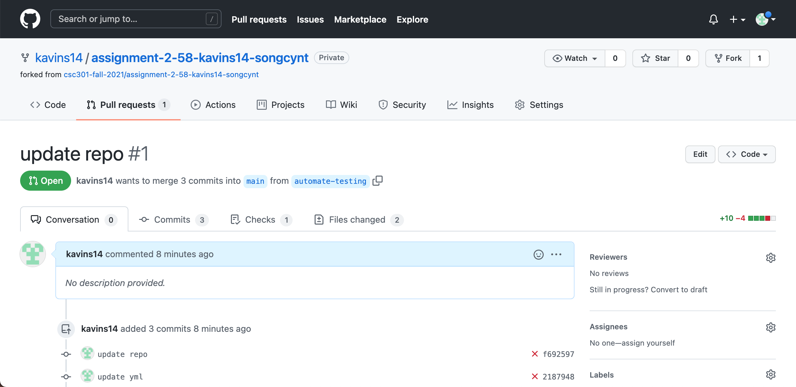
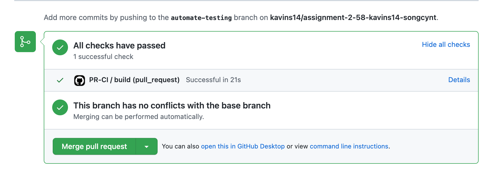
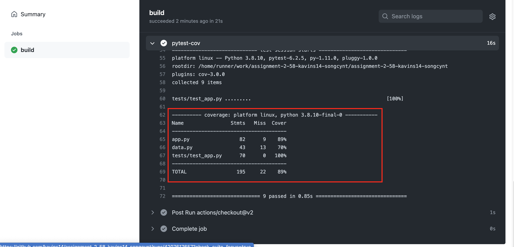
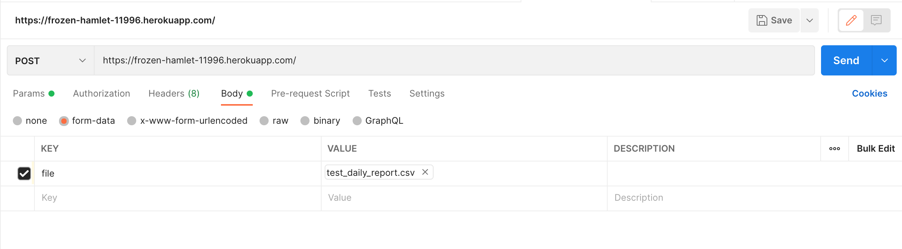

[](https://classroom.github.com/online_ide?assignment_repo_id=6272943&assignment_repo_type=AssignmentRepo)

This project uses `pipenv`, for instructions on how to install/uninstall packages refer to the pipenv's [Basic Usage](https://pipenv.pypa.io/en/latest/basics/).

# Installation Guide

To get started first install pipenv and then run ```pipenv install```. This should install all the required dependencies. If you are using VSCode then select the Python Interpreter named `Python 3.x.x 64-bit (assignment-2-58-kavins14-songcynt-<ID>: pipenv)`.

When first setting up the project run `pipenv install`.

To start the server run the following commands in the terminal:

```bash
> pipenv shell
> flask run
```

## Running Tests

Navigate to the root folder of the repository, activate pipenv shell by running `> pipenv shell` in terminal. Then run the following command:

```bash
> python -m pytest
```

### Coverage report

To generate test coverage report navigate to the root and run the following command:

```bash
> python -m pytest -cov=. tests/
```

# Automated Testing

Automated Testing is set up on a private fork of this repository. The images below show proof of automated testing as well as code coverage.







## Explain the challenges that were solved together

#### Technical Challenges

- Figuring out how to store the data to query.

    Initially we went with a PostgresSQL database, using Psycopg2 to connect and execute queries, and PgAdmin4 to view tables for debugging. We also used Pandas to convert the uploaded csv file to a dataframe. However we got stuck on inserting the data from the dataframe, as several columns such as “Lat” and “Long_” were not needed and were not included in the schema.
In the end due to time constraints, we decided to drop the database and store the dataframe as a pickle (.pkl file) instead.

- Library imports not found or corrupted

  1) No module named psycopg2:

      solved after Kavin added instructions for setting up a virtual environment.

  2) POST request not working for Cynthia since pandas.read_csv didn’t work due to issue with pandas import

      fixed after uninstalling and reinstalling the library.

#### Non Technical Challenges

- Scheduling a meeting to work on the assignment synchronously was difficult since we live off campus and Cynthia works 9am to 5pm on weekdays. Kavin also had assessments from other courses, including one midterm from a course offered at UTM that was scheduled during St. George campus’s reading week.

Solution: we figured that In person pair programming would be difficult, so we decided to go with remote pair programming and installed the VS Live Share extension. Eventually decided to use Zoom’s screen share feature instead which was easier to set up as we’re already familiar with it.

### Roles

#### Kavin's roles:

- Writing the API for Get and Post request in app.py
- Deployment on Heroku and automated testing
- Developing a solution to store uploaded csv data without a PSQL database.

#### Cynthia's roles

- Processing and storing data from csv file in PSQL database (eventually dropped)
- Documentation and reflection on the pair programming process.

## Reflection of the pair programming process

During our first remote pair programming, we used the Live Share extension on VS Code, but it was configured as read-only so the first session was mostly spent on planning and setting up the project.
Subsequent pair programming sessions were also done remotely, but using Zoom screen share which meant each person could code on their own and only share the necessary pieces to demonstrate or ask for help for a feature.
Although we tried to schedule sessions for pair programming, it was difficult to get our availability to match, which meant we had to supplement by working individually.

### Pros of pair programming

- No waiting time when asking for help or clarification on code written by the other person during a live meeting which means “blocking work” can be done faster compared to asking for help through text and having to wait for the other person to respond.

- Planning is much more efficient through calling compared to texting, and the ability to share screens is faster than taking screenshots of the screen when we need to send each other error messages or a piece of code.

### Cons of pair programming

We found that sometimes the actual implementation of features can be very different from what we originally planned, which means sometimes we just need to take the time to experiment on our own before finalizing a plan. For instance, we originally decided on a database with three tables with schemas designed to store both timeseries and daily_report data. However, these files need to be processed in different ways before inserting into the tables, and iterating through the dataframe row by row would be too time consuming which negates the point of implementing a database.

A solution would be for each person to briefly research and test their ideas before the pair programming session, but that would make pair programming essentially the same as individual programming with regular meetings.

## Program Design

For this project, we decided to use Flask which is easier to use in simple applications compared to other frameworks like Django.

We also figured that since the functionalities are limited to file upload, and running queries, we can further simplify the program by only providing one url endpoints, with its functionalities separated by the type of request being made.

We also decided to use parameters for the GET request so that the queries are customizable based on the values entered in the parameters.

We originally planned to implement a PSQL database with Psycopg2, but failed to do so, and due to time constraints we decided to just convert the uploaded csv file in the POST request into a Dataframe, and storing it as a pkl file. 


## API

### Development and Testing Strategy

The API was tested with Postman on url <http://127.0.0.1:5000/> (default address after starting flask project)
Sending a GET request to the API with any or no parameters or body (before a POST request is made) will a `Method Not Supported` Error.

Using the API will require a csv file upload via a POST request.

### Production

The server is live at https://frozen-hamlet-11996.herokuapp.com/.

### POST request

 Endpoint: `/`

 Inside the body of the request, add a form-data with `key=”file”`, and value as valid csv file.

### GET request

 Endpoing: `/data`

 Send a get request with the following query parameters, where the value on the left is the key, and value on left is the actual value being sent.

 ```python
  country: str  # the country or region to filter by
  state: str  # the state or province to filter by
  ck: str  # the combined key
  csv: bool  # whether the response body should be in csv format
```

## Example API Calls

### Uploading CSV File



### Querying without any filters

Send a GET request to the following URL: 
```
https://frozen-hamlet-11996.herokuapp.com/data
```

### Querying by Country

Send a GET request to the following URL: 
```
https://frozen-hamlet-11996.herokuapp.com/data?country=Canada
```

### Querying by State

Send a GET request to the following URL: 
```
https://frozen-hamlet-11996.herokuapp.com/data?state=Yukon
```

### Querying by Combined Key

Send a GET request to the following URL: 
```
https://frozen-hamlet-11996.herokuapp.com/data?ck=Yukon, Canada
```

### Querying  by Country with csv output

Send a GET request to the following URL: 
```
https://frozen-hamlet-11996.herokuapp.com/data?country=Canada&csv=True
```

### Querying by Country and State

Send a GET request to the following URL: 
```
https://frozen-hamlet-11996.herokuapp.com/data?state=Yukon&country=Canada
```

### Complex Query

Send a GET request to the following URL: 
```
https://frozen-hamlet-11996.herokuapp.com/data?state=Yukon&country=Canada&ck=Yukon, Canada&csv=True
```
